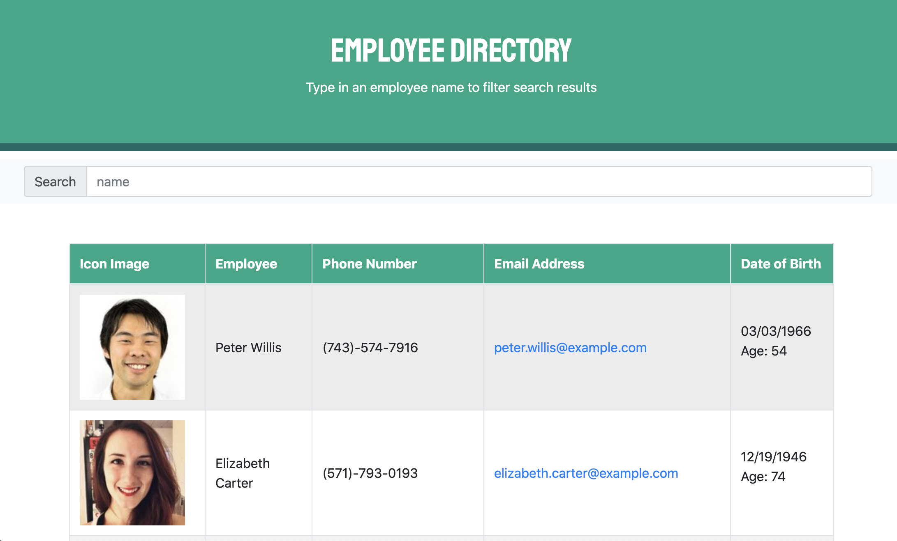

# Employee-Directory


## Deployed Site:
https://rk-employee-directory.herokuapp.com/





---

## Description

  *The what, why, and how:*

`PROJECT DESCRIPTION:` For this assignment, we had to create an employee directory with React. In order to do this, we had to break up our user interface into components and manage the state of the components based on the user interaction. We were required to be able to search by at least one category and sort by one category.

`WHAT IS IT FOR?:` Both employees and managers would benefit from an application like this where they can view information aobut other employees like their email and birthday. The search functionality is especially useful if an employee or manager wants to search for a specific employee. When you click 'name', the employees will be sorted by the first letter of their first name. When you click 'dob', the employees will be sorted by their age/date of birth.


  ---


## Table of Contents

  - [Deployed Site](#deployed-site)
  - [Description](#description)
  - [Usage](#usage)
  - [Technologies](#technologies)
  - [Directory Structure](#directory-structure)
  - [Questions](#questions)
 
 ---


## Usage
  *Instructions and examples for use:*

To run this application:
1. Visit the deployed link above

2. Search for an employee name

3. See the results filter to whatever you are typing in the search bar!

---


## Technologies
*Technologies used in this project:*
 - Javascript
 - Node.js
 - Reat.js

 ---
 

## Directory Structure
```
├── node_modules
│ 
├── public
│   └── index.html   
│
├── >rmImgs
│
├── src
│    └── App.js
│    └── index.js
│   >components
│       └── Header.js
│       └── Main.js
│       └── Nav.js
│       └── Search.js
│       └── Table.js 
│       └── UserBody.js 
│       └── UserInfo
│       └── Wrapper.js 
│   >styles
│       └── Header.css
│       └── Search.css  
│   >utils
│       └── API.js
│       └── DataAreaContext.js
│ 
├── package.json
│ 
│ 
└── README.md
```

---


## Questions?

  *For any questions about this application, please contact me via the information below:*

  * **GitHub:** https://github.com/rachelkline
  
  * **Email:** rachel_kline@icloud.com

---
  <br>

  [Icons provided by https://fontawesome.com/]